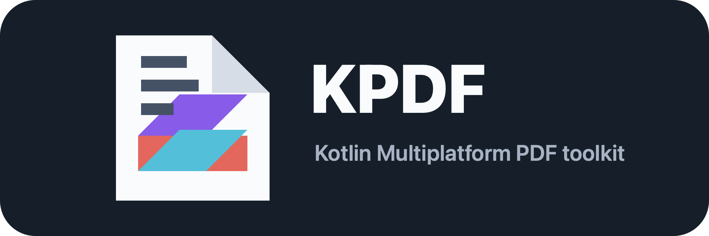

<p align="center">
  
</p>

# KPDF

KPDF is a Kotlin Multiplatform PDF library for Android and iOS with a Compose Multiplatform viewer layer.

## Modules

- `kpdf-core`: shared PDF loading, rendering, caching, save/export, and local picker state APIs
- `kpdf-compose`: Compose viewer and platform integrations for save/open flows

## Version

Current version: `1.1.0`


## Installation

After publishing to Maven Central, add the library modules to your Gradle dependencies:

```kotlin
implementation("io.github.mahmoud947:kpdf-core:1.1.0")
implementation("io.github.mahmoud947:kpdf-compose:1.1.0")
```

Make sure the consumer project includes `mavenCentral()` in its repositories.


## Current Features

- URL, Base64, bytes, and resource-backed PDF sources
- RAM page cache
- disk page cache
- remote source persistence for offline reopen
- configurable page preloading
- shared zoom state
- save/export flow from `KPdfViewerState`
- open-in-external-app flow from `KPdfViewerState`
- open-from-device flow from `KPdfViewerState`
- connected toolbar view
- connected thumbnail strip view
- Android and iOS Compose support

## Quick Start

```kotlin
@Composable
fun PdfScreen(source: KPdfSource) {
    val stableSource = remember(source) { source }
    val viewerConfig = remember {
        KPdfViewerConfig.builder()
            .enableSwipe(true)
            .ramCacheSize(6)
            .diskCacheSize(24)
            .preloadPageCount(2)
            .build()
    }

    val viewerState = rememberPdfViewerState(
        source = stableSource,
        config = viewerConfig,
    )

    KPdfViewer(state = viewerState)
}
```

Keep `source` and `config` stable in Compose. If you rebuild `KPdfViewerConfig` inline on every recomposition, `rememberPdfViewerState(...)` will recreate the viewer state and transient flows such as `openDocumentState` can appear to reset back to `Idle`.

## Connected Views

KPDF also exposes optional connected views that share the same `KPdfViewerState`.

```kotlin
var thumbnailsVisible by remember { mutableStateOf(true) }

KPdfViewerToolbar(
    state = viewerState,
    isThumbnailStripVisible = thumbnailsVisible,
    onThumbnailToggle = { thumbnailsVisible = it },
    onShareClick = { /* custom share flow */ },
)

KPdfViewer(state = viewerState)

KPdfVerticalViewer(state = viewerState)

KPdfViewer(
    state = viewerState,
    loadingContent = { CircularProgressIndicator() },
    errorContent = { message -> Text(message) },
)

if (thumbnailsVisible) {
    KPdfThumbnailStrip(
        state = viewerState,
        onPageClick = { pageIndex ->
            viewerState.goToPage(pageIndex)
        },
    )
}
```

## Open A Local PDF

The library returns the selected source through `openDocumentState`. The app decides whether to replace the current document.

```kotlin
val openState by viewerState.openDocumentState.collectAsState()

LaunchedEffect(openState) {
    val selectedSource = (openState as? KPdfOpenDocumentState.Success)?.source
        ?: return@LaunchedEffect

    viewerState.open(selectedSource)
}

Button(onClick = { viewerState.requestOpenFromDevice() }) {
    Text("Open Local")
}
```

If `openDocumentState` never moves to `AwaitingSelection` or `Success`, first make sure the same `viewerState` instance is being retained across recompositions by remembering the `source` and `KPdfViewerConfig`.

## Save The Current PDF

```kotlin
Button(onClick = { viewerState.requestSave() }) {
    Text("Save")
}
```

## Open In External PDF Viewer

```kotlin
Button(onClick = { viewerState.openInExternalApp() }) {
    Text("Open In External App")
}
```

## Documentation

- Hosted documentation: [Mintlify Docs](https://mahmoud-b28887f9.mintlify.app/)
- Library guide: [docs/SDK.md](docs/SDK.md)
- Integration guide: [docs/INTEGRATION.md](docs/INTEGRATION.md)

## Verification

```bash
./gradlew \
  :kpdf-core:testAndroidHostTest \
  :kpdf-core:compileKotlinIosSimulatorArm64 \
  :kpdf-compose:compileKotlinIosSimulatorArm64 \
  :composeApp:compileDebugKotlinAndroid
```

### DEMO

https://github.com/user-attachments/assets/4d590fe5-e503-4954-bd96-0735c9d718c7
